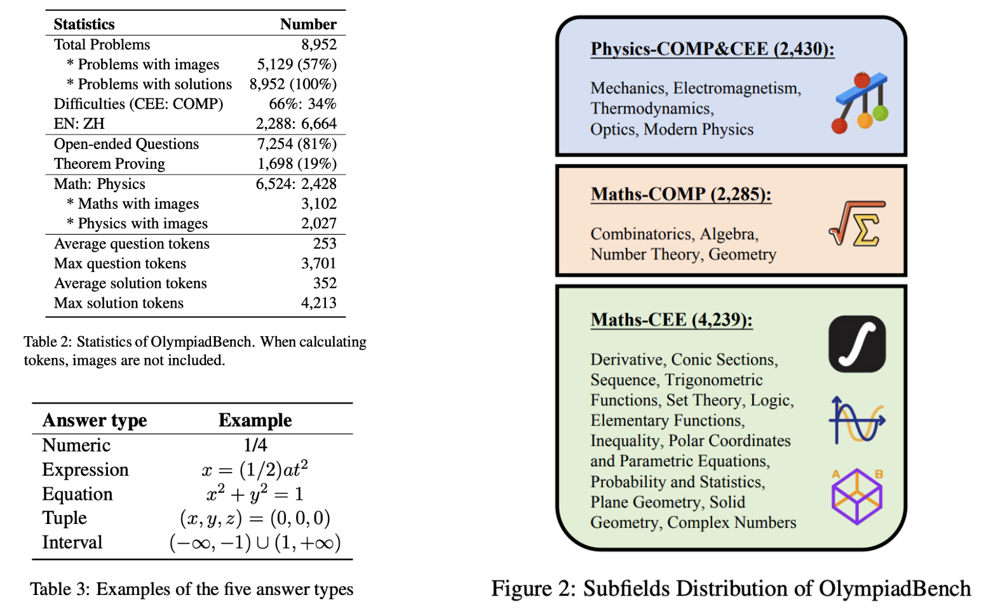

<p align="center">        </p>

<p align="center">
   ⏬ <a href="#data.zip" target="_blank">Data</a> •   📃 <a href="https://arxiv.org/pdf/2402.14008.pdf" target="_blank">arXiv</a>
</p>


This repo contains the evaluation code for the paper "[OlympiadBench: A Challenging Benchmark for Promoting AGI with
Olympiad-Level Bilingual Multimodal Scientific Problems](https://arxiv.org/pdf/2402.14008.pdf)"

## News!

The experiment code is coming soon!

- **[2024-02-16]** The 🔥🔥OlympiadBench🔥🔥 benchmark is released! You can download the dataset from [here](#data.zip).

## Overview

We introduce OlympiadBench, an Olympiad-level bilingual multimodal scientific benchmark. Notably, the best-performing model, GPT-4V, attains an average score of 17.23\% on OlympiadBench, with a mere 11.28\% in physics, highlighting the benchmark rigor and the intricacy of physical reasoning. 

## Data process
This collection comprises 8,952 math and physics problems sourced from:
- International Olympiads;
- Chinese Olympiads;
- the Chinese College Entrance Exam (GaoKao)

<!-- Comparisons with related benchmarks are as follows, which show OlympiadBench has a significant advantage.
<p align="center">
      
</p> -->


We use Mathpix OCR to parse official PDFs, then meticulously inspect, clean, revise and dedupe the data. Finally, we annotate the data with crucial information such as answer types and subfields, yielding a dataset that is clean, accurate, and detailed. OlympiadBench includes open-ended questions and proof problems. For the open-ended questions, we standardize the answer format and develop an automated scoring pipeline [here](eval/auto_scoring_judge.py). For the proof problems, we conduct sample assessments.
<!--  -->
<p align="center"></p>

## Experiments

We take both open- and closed-source LLMs and LMMs into consideration. Such as GPT-4V, Gemini-Pro-Vision, Yi-VL-34B, DeepSeekMath-7B-RL.
We evaluate the models in a zero-shot setting, and the prompt template for English and Chinese openended questions is shown as follows.

<p align="center"></p>

The key results are as follows:
- GPT-4V only achieves 17.23%. GPT4 gets 29.50% on text-only tasks. 
- A huge gap between closed- and open-source models.
- The challenge lies more on question-with-images, Physics and none-English text.

<p align="center"></p>

## Contact
If interested in our work, please contact us at:

- Chaoqun He: hcq21@mails.tsinghua.edu.cn, hechaoqun1998@gmail.com
- Renjie Luo: renjie.luo@outlook.com
- Yuzhuo Bai: byz22@mails.tsinghua.edu.cn

## Citation

**BibTeX:**
```bibtex
@misc{he2024olympiadbench,
      title={OlympiadBench: A Challenging Benchmark for Promoting AGI with Olympiad-Level Bilingual Multimodal Scientific Problems}, 
      author={Chaoqun He and Renjie Luo and Yuzhuo Bai and Shengding Hu and Zhen Leng Thai and Junhao Shen and Jinyi Hu and Xu Han and Yujie Huang and Yuxiang Zhang and Jie Liu and Lei Qi and Zhiyuan Liu and Maosong Sun},
      year={2024},
      eprint={2402.14008},
      archivePrefix={arXiv},
      primaryClass={cs.CL}
}
```